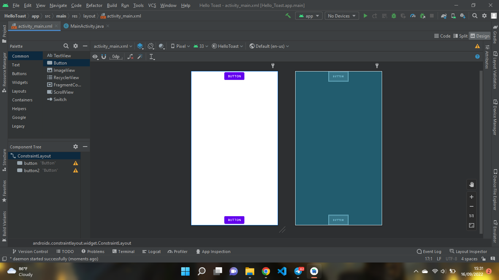
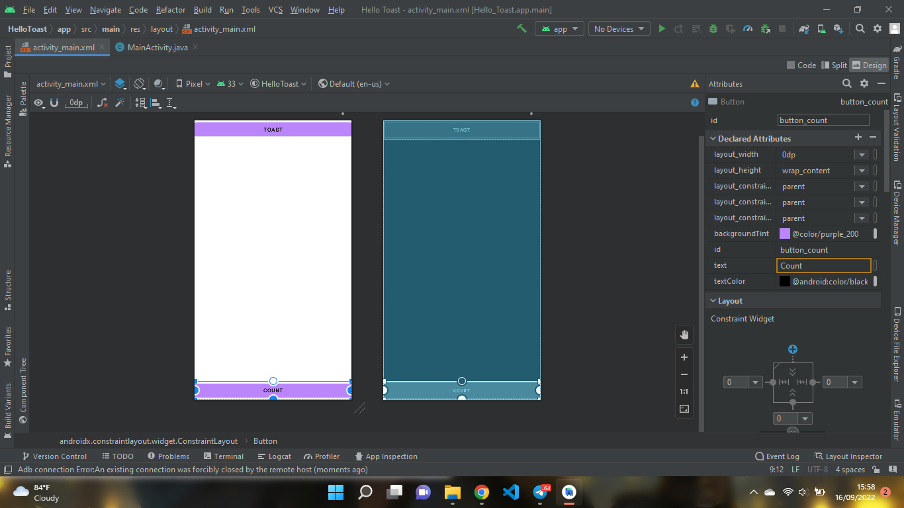
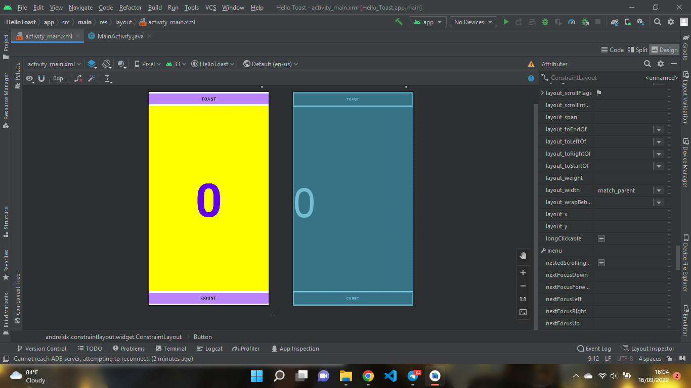
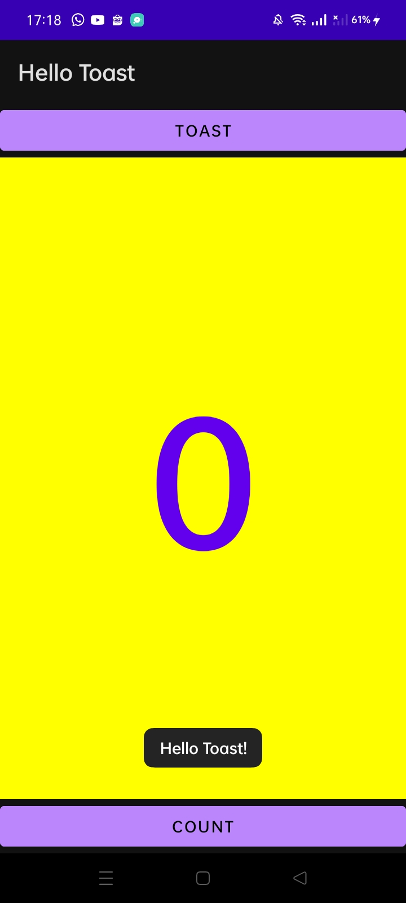
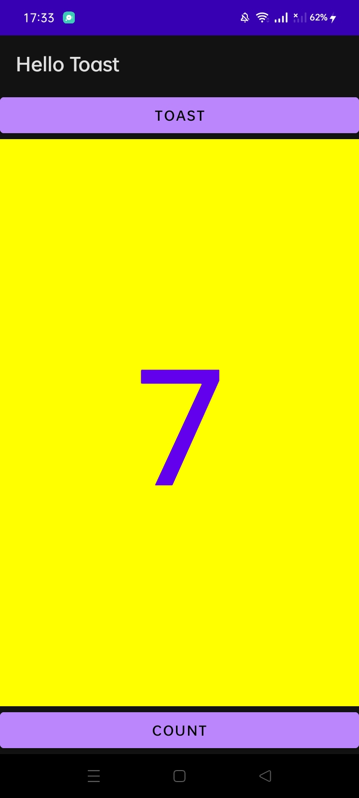
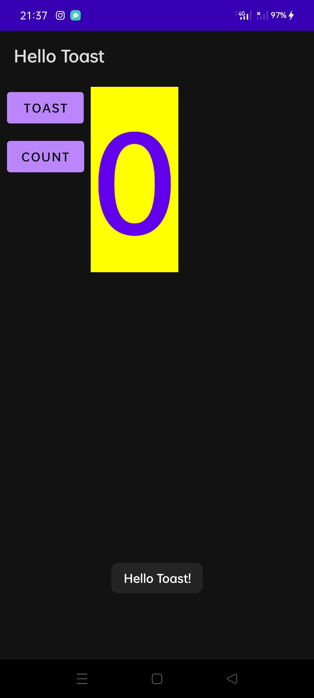
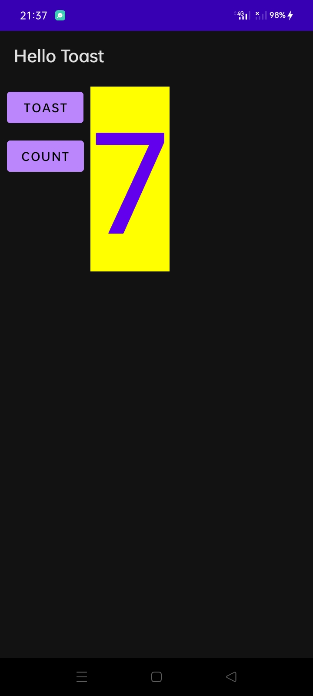
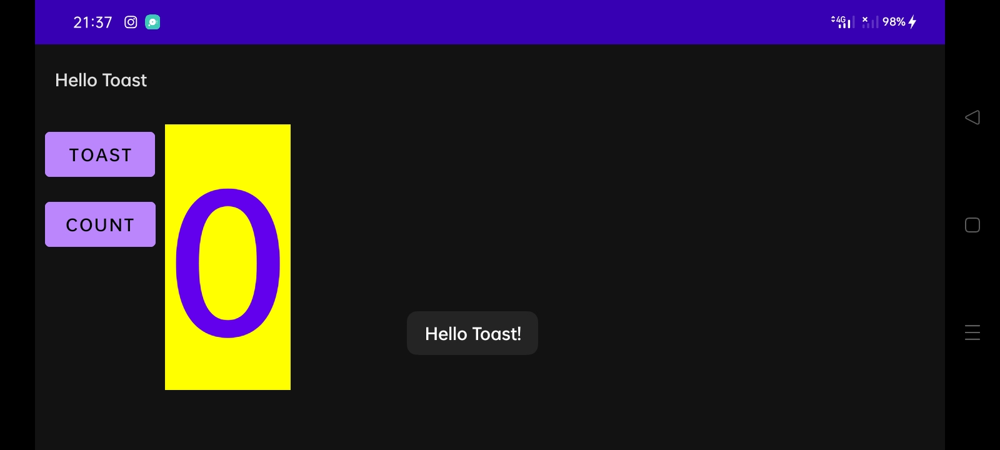
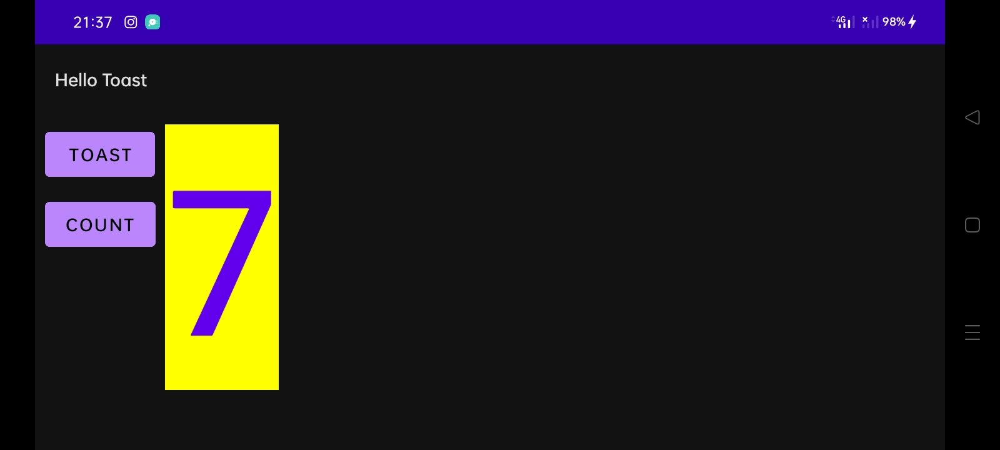

# android-layout-part-a
# PRAKTIKUM
## Add a button to the layout

## Change the button size and attributes

## Edit the layout in XML

## Final results

# CODING CHALLENGE
## Change the layout so that it looks good in both horizontal and vertical orientations:

